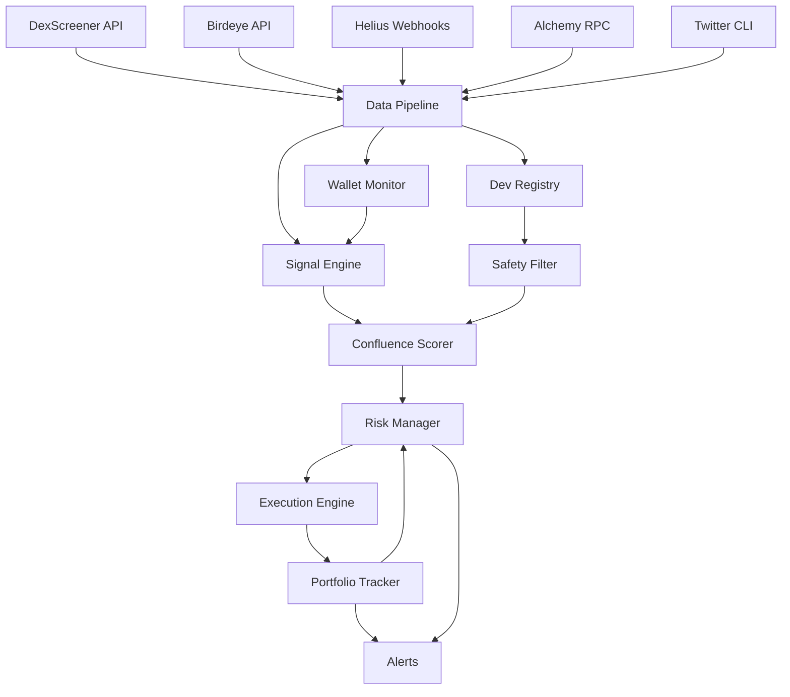
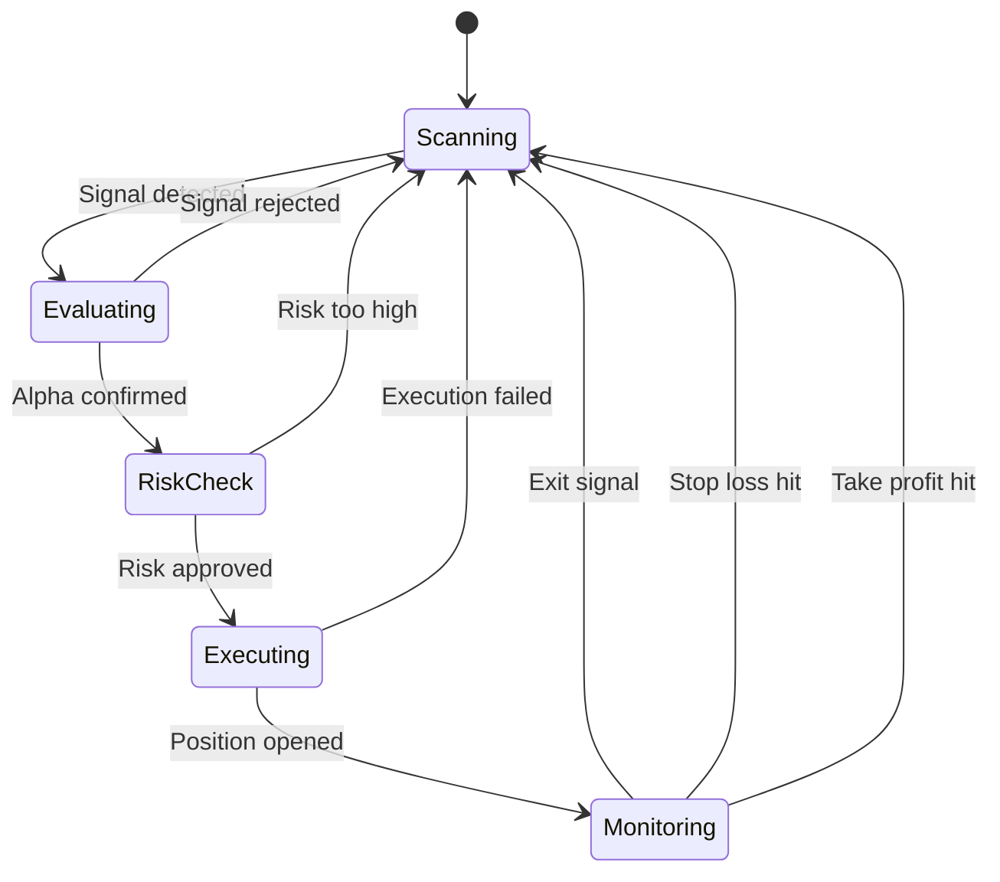

# SolAgent: Autonomous Multi-Chain Trading Agent

## Overview

A Rust-based, fully autonomous on-chain trading agent targeting Solana and Base. Multi-phase build with institutional-grade execution, multiple alpha confirmation methods, reimplemented from scratch after deep-diving open-source repos. Operated via a unified CLI, deployable locally or on Railway. Free-tier APIs only.

---

## Architecture

```
solagent/
├── Cargo.toml                    # workspace root
├── crates/
│   ├── solagent-core/            # shared types, config, errors, events
│   ├── solagent-data/            # API clients (DexScreener, Birdeye, Helius, Jupiter, Alchemy)
│   ├── solagent-chain-solana/    # Solana-specific: RPC, SPL, pump.fun parsing
│   ├── solagent-chain-base/     # Base-specific: RPC, ERC-20, Uniswap routing
│   ├── solagent-signals/         # signal detection engine (5 signal types)
│   ├── solagent-safety/          # token safety scoring, rug detection, dev registry
│   ├── solagent-risk/            # position sizing, drawdown limits, circuit breakers
│   ├── solagent-exec/            # execution engine (swap routing, MEV protection)
│   ├── solagent-portfolio/       # position tracking, PnL, portfolio state
│   ├── solagent-agent/           # autonomous agent loop, state machine, strategies
│   └── solagent-cli/             # unified CLI binary (clap)
├── skills/                       # SKILL.md files (agent instruction sets)
│   ├── skill-scanner.md
│   ├── skill-whale-tracker.md
│   ├── skill-safety.md
│   ├── skill-executor.md
│   ├── skill-portfolio.md
│   └── skill-twitter-alpha.md
├── config/
│   ├── default.toml
│   └── strategies/               # per-strategy TOML configs
└── migrations/                   # SQLite schema migrations
```

### Data Flow



### Agent State Machine



---

## Build Phases

### Phase 0: Repo Audit & Recon (Week 1-2)

**Goal**: Deep-dive every repo from the knowledge base. Verify safety, extract core algorithms, grade alpha value.

**Repos to audit** (in priority order):
1. `GMGNAI/gmgn-skills` -- understand their API surface, signal types, agent skill format
2. Zentryx (Blvckninja) -- whale consensus algorithm, Birdeye API integration patterns
3. SLIP (@Vellan_3) -- VERDICT/MIRROR/PAYSLIP logic, trade autopsy methods
4. Birdeye Aegis (@sandman_sh) -- safety scoring formula, rug detection heuristics
5. RugRadar (@NisargPatel5563) -- real-time rug score calculation
6. `techie__ghost/solana-indexer` -- gRPC streaming patterns, whale detection logic
7. PumpSniper repos (multiple) -- pump.fun launch detection, first-block execution
8. Solana Pump.fun Sniper Bots -- buy/sell automation, TP/SL patterns
9. `Vyntral/arkham-intelligence-claude-skill` -- wallet investigation automation
10. `iamnas/SolanaWhaleAlert` -- Telegram bot patterns for alerts

**Deliverables**:
- Audit report per repo: safety grade, alpha value (A-F), core algorithm summary, data flows
- Recommended reimplement list (what makes the cut)
- API integration notes (DexScreener schema, Birdeye schema, Helius webhook types)
- SKILL.md template finalized

**Decision gate**: Only repos graded A or B proceed to reimplement. C-grade repos contribute ideas only.

---

### Phase 1: Core Infrastructure (Week 2-4)

**Crate: `solagent-core`**
- Config system: TOML-based, hot-reloadable, environment variable override
- Error types: unified `SolAgentError` with chain-specific variants
- Event bus: `tokio::sync::broadcast` based, typed events
- Logging: `tracing` with structured JSON output
- Database: SQLite (via `sqlx`), tables for: tokens, wallets, signals, trades, portfolio snapshots
- Key management: encrypted keyfile (AES-256-GCM), password-derived key via argon2, never logged

**Crate: `solagent-data`**
- Rate-limited HTTP client with backoff (`reqwest` + `governor`)
- DexScreener client: new pairs, token search, pair data, boosted tokens
- Birdeye client: token price, holder data, wallet PnL, top traders, security data
- Helius client: webhook registration, DAS API, parsed transactions (100+ types)
- Jupiter client: quote API, swap API, price API (v6)
- Alchemy client (Base): token balances, NFTs, transaction history
- Response caching layer (TTL-based, in-memory with optional Redis on Railway)

**Crate: `solagent-chain-solana`**
- RPC pool with failover (multiple free RPC endpoints)
- SPL token parsing, ATA derivation
- Transaction building, signing, simulation, sending
- Priority fee estimation
- pump.fun program event parsing (new token creation, buy/sell events)

**Crate: `solagent-chain-base`**
- RPC connection via Alchemy free tier
- ERC-20 token parsing
- Uniswap V2/V3 pair discovery and routing
- Gas estimation, EIP-1559 fee calculation

**Deliverables**:
- All API clients functional with integration tests against live endpoints
- Rate limit tracking and adaptive throttling
- Config-driven RPC endpoint rotation
- Can query DexScreener for new Solana pairs and print results

---

### Phase 2: Data Pipeline & Wallet Intelligence (Week 4-6)

**Data Ingestion**:
- DexScreener new pairs poller (configurable interval, default 5s)
- DexScreener boosted tokens tracker (promotion = signal)
- Birdeye top traders per token (wallet PnL leaderboard)
- Birdeye holder analysis (concentration, whale holders)
- Helius webhook listener (real-time wallet transactions on Solana)
- Alchemy webhook listener (real-time wallet transactions on Base)
- Twitter signal scraper (invokes `twitter-cli` for keyword searches)

**Wallet Intelligence System**:
- **Wallet Registry**: SQLite table tracking known wallets with metadata
  - Fields: address, chain, label (smart_money/sniper/dev/insider/whale/mev_bot), source, win_rate, total_pnl, avg_hold_time, last_updated
  - Seeded from: GMGN smart money lists, 0x_Discover alpha, manual additions
  - Auto-discovered: when a wallet appears in top traders for multiple profitable tokens
- **Wallet Scorer**: ranks wallets by composite score
  - `score = win_rate * 0.3 + pnl_30d * 0.3 + consistency * 0.2 + recency * 0.2`
- **Dev Wallet Registry**: blacklist of known rug-pulling deployers
  - Seeded from: Wallet Master data, Dextrackr data, community lists
  - Auto-updated: when a dev's token rugs, they're added
- **Wallet Watcher**: real-time tracking of top N wallets (configurable, default 50)
  - Uses Helius webhooks for Solana, Alchemy for Base
  - Fires events: `WalletBuy { wallet, token, amount, chain }`, `WalletSell { ... }`

**Deliverables**:
- Streaming pipeline that can detect new token launches within seconds
- Wallet registry with 500+ pre-seeded smart money wallets
- Real-time alerts when watched wallets make moves
- DexScreener + Birdeye data flowing into SQLite for analysis

---

### Phase 3: Signal Engine (Week 6-8)

**Five independent signal detectors, each emitting scored signals (0-100)**:

1. **Whale Consensus Signal** (reimplemented from Zentryx)
   - Trigger: 2+ smart money wallets buy the same token within configurable window (default: 30 min)
   - Score: based on wallet quality scores, buy amounts, consensus speed
   - `score = sum(wallet_scores) * recency_multiplier * amount_multiplier`
   - Chains: Solana + Base

2. **Smart Money Accumulation Signal**
   - Trigger: Smart money wallets quietly increasing position without price movement
   - Detection: Holder count increasing + price flat/down = accumulation phase
   - Score: based on number of accumulating wallets, duration, total accumulated %
   - Data: Birdeye holder API + on-chain holder snapshots

3. **New Launch Momentum Signal**
   - Trigger: New token with rapidly growing holder count + volume
   - Detection: Holder growth rate (holders/min), volume spike relative to liquidity
   - Filters: Min liquidity ($5K), min holders (50), max age (1 hour)
   - Score: holder_growth_rate * volume_liquidity_ratio * age_penalty

4. **Volume Spike Signal**
   - Trigger: 3x+ average volume in a 5-min window for an existing token
   - Detection: Rolling volume average vs current window
   - Score: spike magnitude * duration * whether smart money is involved

5. **Social Momentum Signal** (via twitter-cli)
   - Trigger: Keyword/CA mention spike on Twitter
   - Detection: Poll twitter-cli every 60s for trending CAs, engagement metrics
   - Score: mention_count * engagement_rate * influencer_weight

**Confluence Scorer**:
- Takes all active signals for a token
- Weighted composite: `confluence = sum(signal_score * weight)` where weights are configurable
- Default weights: whale_consensus=0.30, accumulation=0.20, launch_momentum=0.20, volume_spike=0.15, social=0.15
- Trade threshold: configurable, default `confluence >= 65`
- Outputs: `TradeCandidate { token, chain, confluence_score, signals, timestamp }`

**Deliverables**:
- All 5 signal detectors running concurrently
- Confluence scorer producing ranked trade candidates
- Can detect a whale consensus event and score it end-to-end
- Integration test: simulate wallet buys, verify signal fires

---

### Phase 4: Safety & Risk Layer (Week 8-10)

**Crate: `solagent-safety`** -- Token Safety Scoring (reimplemented from Aegis + RugRadar)

**Safety Score (0-100)**, computed from:
1. **Mint Authority** (0 or 15 pts): Is mint authority revoked? If not, dev can mint infinite tokens.
2. **Freeze Authority** (0 or 10 pts): Is freeze authority revoked? If not, dev can freeze your tokens.
3. **LP Lock** (0-20 pts): Is liquidity locked? For how long? Score proportional to lock duration.
4. **Top Holder Concentration** (0-15 pts): What % do top 10 holders own? <20% = max, >50% = 0.
5. **Dev Wallet Clean** (0 or 15 pts): Is deployer in our blacklist? Known rugger = 0.
6. **Dev Token Holdings** (0-10 pts): Does dev hold >5% of supply? Penalize heavily.
7. **Honeypot Check** (0 or 15 pts): Can tokens actually be sold? Simulate a sell transaction.
8. **Tax Check** (0-10 pts): Are there hidden buy/sell taxes? >5% tax = 0.

**Safety threshold**: `score >= 60` to proceed (configurable)

**Dev Wallet Blacklist**:
- Seeded from Wallet Master data (6M+ devs tracked)
- Auto-updated: when token rugs, deployer added
- Cross-referenced on every new token evaluation

**Crate: `solagent-risk`** -- Institutional Risk Management

- **Position Sizing**: Fixed fractional method (default: 2% of portfolio per trade, configurable)
- **Max Position**: 5% of portfolio in any single token
- **Max Open Positions**: 10 concurrent (configurable)
- **Correlation Limit**: Max 3 positions in same narrative sector (memecoin, AI token, etc.)
- **Daily Loss Limit**: 5% of portfolio -- if hit, stop trading until next day
- **Drawdown Circuit Breaker**: 10% portfolio drawdown from peak -- halt all trading, alert user
- **Per-Chain Exposure**: Max 70% on one chain
- **Cooldown**: After a loss, 5-min cooldown before next trade (prevent tilt)
- **Stop Loss**: Default -20% per position (configurable per strategy)
- **Take Profit**: Default +50% per position, with trailing stop at -10% from peak

**Deliverables**:
- Safety scorer that can evaluate any Solana/Base token in <2 seconds
- Risk manager that blocks trades violating any rule
- Circuit breaker that halts the entire agent on drawdown
- All risk parameters configurable via TOML

---

### Phase 5: Execution Engine (Week 10-12)

**Crate: `solagent-exec`** -- Institutional-Grade Execution

**Solana Execution**:
- Jupiter V6 quote API for best route
- Transaction simulation before every send (catch failures early)
- Priority fee estimation via Helius (get recent priority fees)
- Slippage protection: default 1%, max 3%, configurable
- MEV protection: Jito bundles for anti-sandwich (if free tier available), else priority fee bump
- Retry logic: on failure, re-quote with 0.5% higher slippage, retry up to 3 times
- Pre-flight checks: balance verification, token account existence

**Base Execution**:
- Uniswap V3 router for best execution
- EIP-1559 gas estimation with priority fee
- Transaction simulation via Alchemy `eth_estimateGas`
- Slippage protection via deadline + amountOutMinimum

**Common Execution Flow**:
```
1. Get quote (Jupiter/Uniswap)
2. Simulate transaction
3. Check simulated slippage <= threshold
4. If pass: sign + send
5. If fail: re-quote with adjusted params, retry (max 3)
6. Track execution: quote_vs_actual, slippage, latency_ms
```

**Execution Quality Metrics**:
- Slippage: actual vs quoted (target: <1%)
- Latency: signal_to_execution_ms (target: <3 seconds end-to-end)
- Success rate: confirmed/attempted (target: >95%)

**Deliverables**:
- Can execute a swap on Solana via Jupiter in <3s from signal
- Can execute a swap on Base via Uniswap
- Simulation catches >99% of would-be failures before sending
- Execution quality tracked per trade

---

### Phase 6: Agent Loop, CLI & Skills (Week 12-14)

**Crate: `solagent-agent`** -- Autonomous Agent

- **Main loop**: `tokio::select!` over signal channels
- **State machine**: Scanning -> Evaluating -> RiskCheck -> Executing -> Monitoring (as diagrammed above)
- **Strategy system**: pluggable strategies, each defines entry/exit rules
  - `WhaleConsensus` -- follow smart money buys
  - `NewLaunchSniper` -- early entry on clean launches
  - `AccumulationPlay` -- buy when smart money accumulates
  - `MomentumRide` -- ride volume + social spikes
- **Agent config**: which strategies are active, per-strategy parameters
- **Decision logging**: every evaluation logged with full reasoning (which signals fired, scores, why accepted/rejected)

**Crate: `solagent-cli`** -- Unified CLI

```
solagent scan [--chain solana|base|all] [--new] [--filter]
solagent track --wallet <addr> [--chain solana|base]
solagent analyze --token <CA> [--chain solana|base]
solagent trade --buy <CA> --amount <SOL> [--chain solana|base]
solagent trade --sell <CA> [--amount <pct>]
solagent portfolio [--status] [--pnl] [--history]
solagent wallet --list [--top-performers] [--blacklist]
solagent agent --start [--strategy <name>] [--dry-run]
solagent agent --stop
solagent agent --status
solagent config --show [--strategy <name>]
solagent config --set <key> <value>
solagent db --migrate
solagent db --stats
```

**SKILL.md Files** (6 total, one per subsystem):

1. **skill-scanner.md** -- How to use `solagent scan`, interpret new launch data, filter tokens
2. **skill-whale-tracker.md** -- How to add/remove tracked wallets, interpret wallet events, build watchlists
3. **skill-safety.md** -- How to analyze a token's safety score, read rug detection results, interpret dev wallet data
4. **skill-executor.md** -- How to execute trades, understand execution quality, manage slippage
5. **skill-portfolio.md** -- How to read portfolio state, PnL, adjust risk parameters
6. **skill-twitter-alpha.md** -- How to use twitter-cli integration, parse social signals, set up keyword monitoring

**Deliverables**:
- CLI binary that runs the full agent loop
- Can start agent with `solagent agent --start` and it runs autonomously
- All 6 SKILL.md files written
- Every decision logged with reasoning

---

### Phase 7: Deployment & Hardening (Week 14-16)

**Railway Deployment**:
- Dockerfile for the CLI binary
- PostgreSQL instead of SQLite on Railway
- Environment variable injection for keys, RPC URLs, API keys
- Health check endpoint (`/health`)
- Graceful shutdown on SIGTERM

**Monitoring & Alerts**:
- Structured JSON logging (already in place from Phase 1)
- Telegram bot for: trade executed, trade closed, circuit breaker triggered, agent started/stopped
- Daily summary: PnL, win rate, trade count, best/worst trade

**Security Hardening**:
- Private keys encrypted at rest (already in Phase 1)
- No keys in logs, config files, or error messages
- Rate limiting on all external API calls (stay within free tiers)
- Transaction simulation before every send (already in Phase 5)
- Circuit breakers tested under stress

**Deliverables**:
- Agent running on Railway 24/7
- Telegram alerts for all key events
- Can survive Railway restarts (state persisted to DB)
- Security audit checklist passed

---

## Key Technical Decisions

| Decision | Choice | Rationale |
|---|---|---|
| Language | Rust | User choice. Max speed, memory safety, single binary. |
| Async runtime | tokio | Standard Rust async. Handles thousands of concurrent tasks. |
| Database | SQLite (local) / PostgreSQL (Railway) | sqlx supports both with same query interface. |
| API clients | reqwest + governor | Battle-tested HTTP + rate limiting. |
| Serialization | serde + serde_json | Standard. |
| CLI framework | clap v4 | Standard Rust CLI. |
| Logging | tracing + tracing-subscriber | Structured, async-aware logging. |
| Chain abstraction | Trait-based | `ChainProvider` trait with Solana and Base implementations. |
| Strategy pattern | Trait-based | `Strategy` trait with `evaluate() -> Signal` method. |

## API Budget (Free Tier Limits)

| API | Free Limit | Strategy |
|---|---|---|
| DexScreener | 300 req/min | Poll new pairs every 5s, cache results |
| Birdeye | ~1 req/sec | Batch queries, cache for 30s |
| Helius | 1M credits/mo | Reserve for webhooks + critical queries |
| Jupiter | Unlimited (no key) | Use freely for quotes + swaps |
| Alchemy (Base) | 300M CU/mo | Budget ~10M CU/day, prioritize execution |

## Risk Guard Rails Summary

- 2% max portfolio per trade
- 5% max portfolio per token
- 10 max concurrent positions
- 5% daily loss limit (halts trading)
- 10% drawdown from peak (halts agent entirely)
- 60/100 minimum safety score to trade
- 65/100 minimum confluence score to trade
- 5-min cooldown after any loss
- -20% stop loss per position
- +50% take profit with -10% trailing stop

## Execution Targets

- Signal to execution: <3 seconds
- Slippage: <1% average
- Success rate: >95%
- Uptime: 99.5%+
